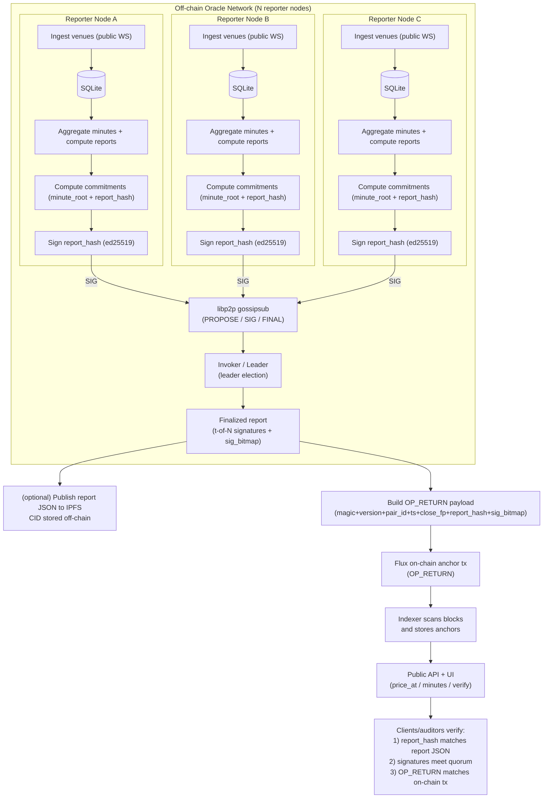

# Flux Price History Oracle (FPHO)

FPHO provides minute-grade FLUXUSD fair market values and commits hourly reports to Flux so historical pricing is independently verifiable.

## How The Decentralized Oracle Works



Security properties:

- Every reporter independently recomputes the same `report_hash` from the minute dataset (deterministic canonicalization + hashing).
- Reporters only sign if the proposed `report_hash` matches their locally computed one.
- The invoker cannot fabricate prices: without a quorum of signatures the anchor is rejected by verifiers.

## Stack

- Node.js `20.x`
- `pnpm`
- TypeScript with `strict: true`
- SQLite for MVP storage

## Monorepo Layout

- `packages/core`
- `packages/venues`
- `packages/ingestor`
- `packages/aggregator`
- `packages/api`
- `packages/cli`
- `packages/p2p`
- `packages/reporter`
- `packages/anchor`
- `packages/indexer`

## Local Run

```bash
pnpm install
pnpm db:migrate
pnpm lint
pnpm test
pnpm build
```

## Development Harness

```bash
docker compose -f docker-compose.dev.yml up --build
pnpm simulate:hour
```

Reporter quorum simulation:

```bash
pnpm simulate:quorum
```

## Database Commands

```bash
pnpm db:migrate
pnpm db:reset
pnpm db:backfill-reporter-set -- --registry ./data/reporter_registry.json
```

## API Quickstart

```bash
pnpm --filter @fpho/api build
FPHO_DB_PATH=./data/fpho.sqlite pnpm --filter @fpho/api start
```

Available endpoints:

```bash
curl 'http://localhost:3000/v1/price_at?pair=FLUXUSD&ts=1707350467'
curl 'http://localhost:3000/v1/minutes?pair=FLUXUSD&start=1707346800&end=1707350400&limit=120'
curl 'http://localhost:3000/v1/minute/FLUXUSD/1707350460/venues'
curl 'http://localhost:3000/v1/anchors?pair=FLUXUSD&start_hour=1707346800&end_hour=1707350400'
curl 'http://localhost:3000/v1/hours?pair=FLUXUSD&start=1707346800&end=1707350400'
curl 'http://localhost:3000/v1/report/FLUXUSD/1707346800'
curl 'http://localhost:3000/v1/verify/FLUXUSD/1707346800'
curl 'http://localhost:3000/v1/methodology'
curl 'http://localhost:3000/healthz'
curl 'http://localhost:3000/metrics'
```

UI:

```bash
open http://localhost:3000/
```

## Anchoring (Library)

`@fpho/anchor` now supports:

- publishing hourly report JSON to IPFS (CID + mirror URL)
- building binary OP_RETURN payloads from hourly reports
- broadcasting anchor transactions through Flux JSON-RPC
- persisting anchor metadata in `anchors`

## Verification Quickstart (CLI)

```bash
pnpm --filter @fpho/cli build
pnpm --filter @fpho/cli run fpho-verify --pair FLUXUSD --hour 1707346800 --registry ./data/reporter_registry.json --check-minute-root
```

## Tax CSV Exports

Input transactions JSON format:

```json
[
  {
    "txid": "abc",
    "timestamp": 1707346812,
    "direction": "in",
    "amount": "2.00000000",
    "asset": "FLUX"
  },
  {
    "txid": "def",
    "timestamp": 1707346899,
    "direction": "out",
    "amount": "3.00000000",
    "asset": "FLUX"
  }
]
```

Export tax packs:

```bash
pnpm --filter @fpho/cli build
pnpm --filter @fpho/cli run fpho-tax-export --input ./data/txs.json --out-dir ./data/tax-csv --base-url http://localhost:3000 --pair FLUXUSD
```

Generated files:

- `full_ledger.csv`
- `income.csv`
- `disposals.csv`

## FMV Rule + Audit Citation

- FMV rule: the tax FMV for a transaction timestamp is the minute bucket reference price from `GET /v1/price_at`.
- Audit citation: include `pair`, `hour_ts`, `report_hash`, and anchor `txid`; retain matching hourly report JSON, OP_RETURN decode output, and quorum verification output.

## Deployment on Flux

Deployment artifacts are under `deploy/`:

- Docker images: `deploy/docker/Dockerfile.api`, `deploy/docker/Dockerfile.cli`
- Flux app specs: `deploy/flux/api-app.spec.json`, `deploy/flux/reporter-app.spec.json`

Scaling guidance:

- Run reporters as quorum nodes only.
- Keep client traffic on API nodes.
- Scale API replicas for read load independently of reporter quorum size.

## VPS (systemd)

Systemd unit templates live in `deploy/systemd/`. See `deploy/systemd/README.md` for installation and log commands.

Raw tick retention (SQLite hygiene):

- `FPHO_RAW_TICK_RETENTION_SECONDS` (default `86400`, set `0` to disable pruning)
- `FPHO_RAW_TICK_PRUNE_INTERVAL_SECONDS` (default `3600`)
